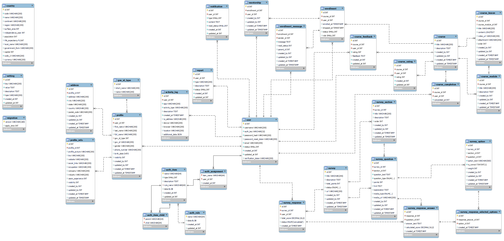

## Documentación Técnica de la base de datos

## Información General

### Propósito
El propósito de esta documentación es dar a conocer la estructura con la que fue diseñada y desarrollada la base de datos del proyecto.

### Tablas
El siguiente, es el listado de tablas que conforman la base de datos:

|Tablas	|Tablas		|Tablas	|Tablas	|
|:-------------:|:-------------:|:-------------:|:-------------|
|activity_log	|address	|auth_assignment	|auth_item|
|auth_item_child	|auth_rule	|country	|course|
|course_completion	|course_feedback	|course_lesson	|course_module|
|course_rating	|enrollment	|enrollment_message	|gov_id_type|
|mentorship	|migration	|notification	|profile|
|profile_info	|report	|setting	|survey|
|survey_option	|survey_question	|survey_response	|survey_response_answer|
|survey_response_selected_options   |survey_section |user| 

### Esquema de la base de datos
Presenta el siguiente esquema:

